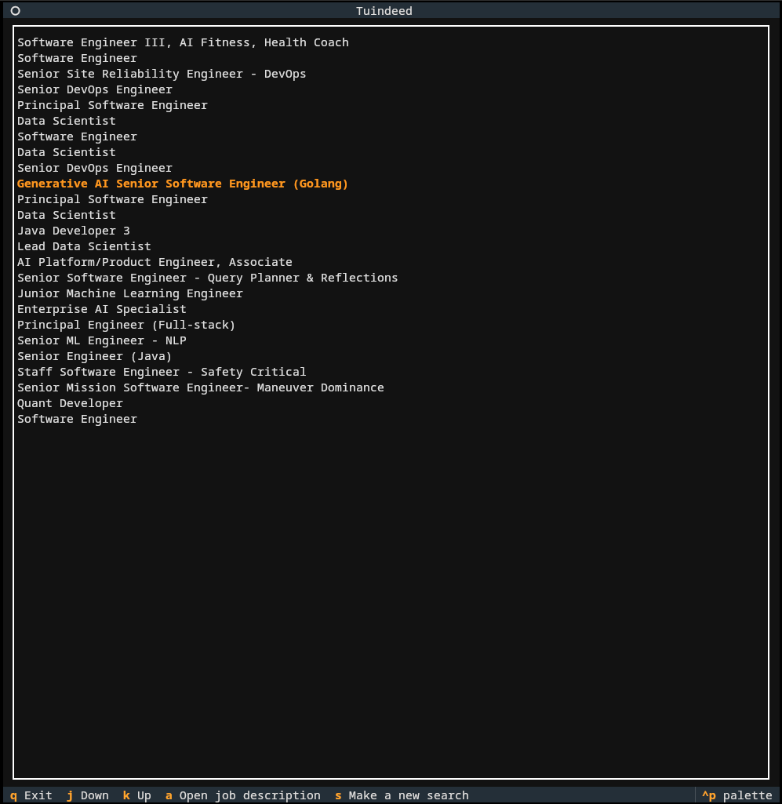
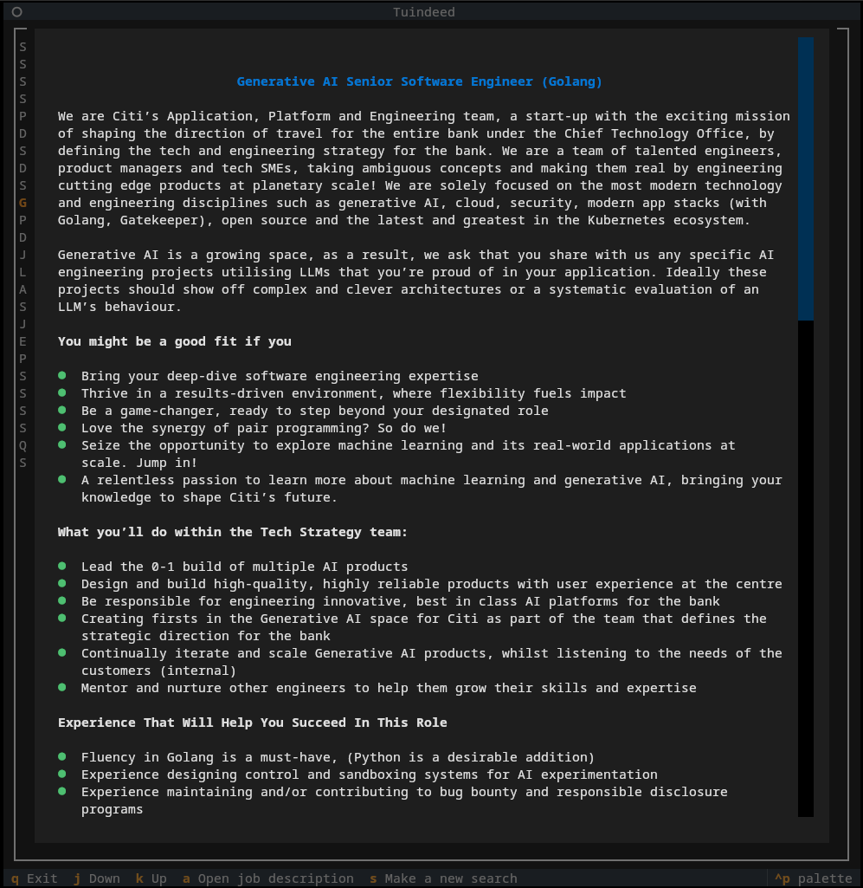

# TUINDEED

This project is currently under active development
Currently it only runs on Linux systems, support for Mac and Windows will come later.

## Description

This project allow you to search for a job without leaving your cozy terminal !

 | 

## Dependencies

You must have :

- Python >=3.10
- Poetry >=2.0.1
- pipx

## Installation

Clone the repo, then install the wheel using pipx.

```bash
git clone https://github.com/periodLeo/tuindeed.git
cd tuindeed

poetry build
pipx install dist/tuindeed-[version_etc].whl
```
